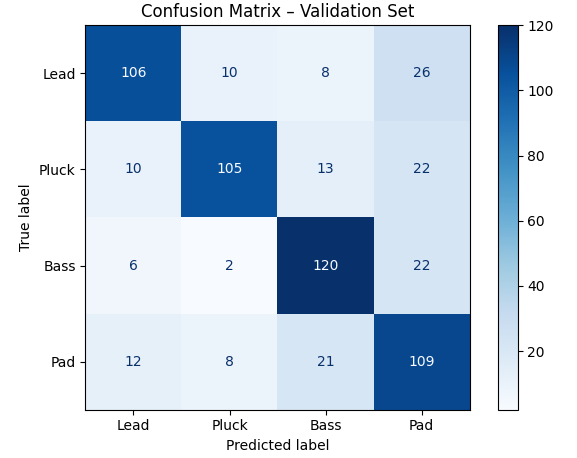

# 🎵 DeepWave AI – Klassifikation urbaner Sounds mit Feature-Engineering & PyTorch

---

## 🔍 Projektüberblick

Dieses Projekt ist ein vollständiger Audio-Classifizierungs-Workflow, der **synthetische Zuordnungen urbaner Geräusche** mittels des Datensatzes [UrbanSound8K](https://urbansounddataset.weebly.com/urbansound8k.html) analysiert, verarbeitet und klassifiziert.

Ziel: Eine robuste Pipeline zur Feature-Extraktion, Trainingsdatenerstellung und neuronaler Klassifikation, die **C++-kompatibel** (TorchScript, ONNX) exportiert werden kann.

---

## 📚 Inhaltsverzeichnis

- [Projektstruktur](#-projektstruktur)
- [Datensatz](#-datensatz)
- [Einrichtung (virtuelle Umgebung)](#️-einrichtung-virtuelle-umgebung)
- [Abhängigkeiten installieren](#-abhängigkeiten-installieren)
- [Verarbeitungs-Pipeline im Detail](#-verarbeitungs-pipeline-im-detail)
- [Architektur des Netzwerks](#-architektur-des-netzwerks)
- [Exportformate für Deployment](#️-exportformate-für-deployment)
- [Evaluation mit ONNX & Confusion Matrix](#-evaluation-mit-onnx--confusion-matrix)
- [FAQ / Fehlersuche](#-faq--fehlersuche)

---

## 📁 Projektstruktur

```plaintext
DEEPWAVE_AI/
├── audio/                  # Audio-Files (UrbanSound8K)
│   ├── fold1/ … fold10/
├── metadata/
│   └── UrbanSound8K.csv   # CSV mit Metadaten zu allen Audiofiles
├── src/
│   ├── data/              # NPY-Features, JSON-Dateien etc.
│   ├── 01_filter_and_label.py
│   ├── 02_split_synth_classes.py
│   ├── 03_extract_cpp_features.py
│   ├── 04_train_classifier.py
│   ├── 05_confusion_matrix_val.py
│   ├── 06_predict_single_file.py
│   ├── 07_export_training_stats.py
├── requirements.txt       # Python-Abhängigkeiten
└── README.md              # Dieses Dokument
```

---

## 🎧 Datensatz

Der verwendete Datensatz ist [**UrbanSound8K**](https://urbansounddataset.weebly.com/urbansound8k.html) – ein realer, annotierter Datensatz mit 8732 Audio-Dateien aus 10 Geräuschklassen.

### 📥 Download

1. Besuche: https://urbansounddataset.weebly.com/urbansound8k.html
2. Lade die ZIP-Datei herunter (ca. 6 GB)
3. Extrahiere:
   - Ordner `fold1` bis `fold10` → nach `audio/`
   - Datei `UrbanSound8K.csv` → nach `metadata/`

### 🎯 Zielklassen (Subset)

| Originalklasse     | Mapping       |
|--------------------|---------------|
| `siren`            | `Lead`        |
| `dog_bark`         | `Pluck`       |
| `engine_idling`    | `Bass`        |
| `street_music`     | `Pad`         |

---

## ⚙️ Einrichtung (virtuelle Umgebung)

### 1. Erstelle und aktiviere die virtuelle Umgebung

#### 💻 Windows:
```bash
python -m venv .venv
.venv\Scripts\activate
```

#### 🐧 macOS / Linux:
```bash
python3 -m venv .venv
source .venv/bin/activate
```

---

## 📦 Abhängigkeiten installieren

```bash
pip install -r requirements.txt
```

### Beispiel `requirements.txt`:

```txt
numpy
pandas
tqdm
soundfile
matplotlib
scikit-learn
torch
onnxruntime
```

---

## 🚀 Verarbeitungs-Pipeline im Detail

### 1. Klassen filtern & labeln

```bash
python src/01_filter_and_label.py
```

→ Erzeugt `filtered_data.json` mit Pfad+Label-Mapping

### 2. Splitten in Train/Val

```bash
python src/02_split_synth_classes.py
```

→ Erstellt `train_data.json` & `val_data.json` mit definiertem Verhältnis.

### 3. Feature-Extraktion

```bash
python src/03_extract_cpp_features.py
```

→ Extrahiert 8 Features pro Datei (Zeit- & Frequenzbereich). Speichert `.npy`-Dateien.

### 4. Modell trainieren

```bash
python src/04_train_classifier.py
```

→ Trainiert ein 3-lagiges MLP-Modell (PyTorch) und exportiert als `.pt` und `.traced.pt`

### 5. Confusion Matrix + Report

```bash
python src/05_confusion_matrix_val.py
```

→ Zeigt Matrix + Precision, Recall, F1 pro Klasse

### 6. Vorhersage einer Datei

```bash
python src/06_predict_single_file.py
```

→ Nutzt ONNX-Modell zur Inferenz einer WAV-Datei aus `val_data.json`

### 7. Training Stats exportieren

```bash
python src/07_export_training_stats.py
```

→ Exportiert `cpp_mean.npy`, `cpp_std.npy` und `float mean[] = {...}`

---

## 🧠 Architektur des Netzwerks

```text
Input: 8 Features
↓
Linear(8 → 128) + ReLU + Dropout(0.3)
↓
Linear(128 → 64) + ReLU + Dropout(0.2)
↓
Linear(64 → 4)
↓
Softmax (via CrossEntropyLoss)
```

---

## 🛠️ Exportformate für Deployment

| Format              | Datei                            | Ziel           |
|---------------------|----------------------------------|----------------|
| `TorchScript`       | `synth_classifier_cpp_traced.pt`| PyTorch C++    |
| `ONNX`              | `synth_classifier_cpp.onnx`     | ONNX Runtime   |
| `Normierung`        | `cpp_mean.npy`, `cpp_std.npy`   | Normalisierung |

---

## 📊 Evaluation mit ONNX & Confusion Matrix

Nach dem Training kannst du eine Evaluation mit ONNX durchführen.

### Beispiel: Konfusionsmatrix



**Legende:**
- Diagonale → korrekt
- Off-Diagonale → Verwechslung

| Klasse | Genauigkeit     | Häufige Verwechslung         |
|--------|------------------|------------------------------|
| Lead   | 106/150 (70.7%) | oft mit Pad verwechselt (26×) |
| Pluck  | 105/150 (70.0%) | etwas mit Pad (22×)           |
| Bass   | 120/150 (80.0%) | gut erkannt                   |
| Pad    | 109/150 (72.7%) | oft mit Bass (21×) verwechselt|

---

## ❓ FAQ / Fehlersuche

- **Dateien nicht gefunden?** → `audio/` Pfade prüfen
- **Leere Feature-Dateien?** → Stille WAVs werden übersprungen
- **ONNX Probleme?** → Input-Shape `[1, 8]` prüfen

---

## 📜 Lizenz

UrbanSound8K © BY-NC Lizenz  
Projekt zu Forschungs- und Lernzwecken.